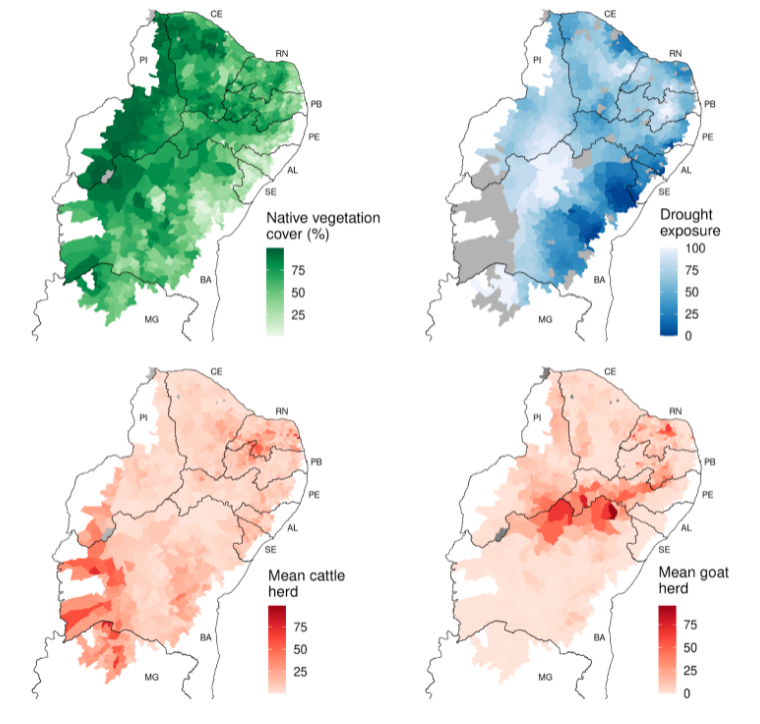
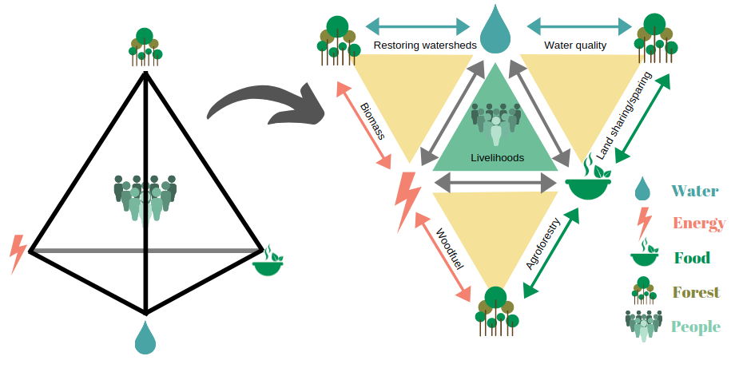

```{r xaringan-tile-view, echo=FALSE}
xaringanExtra::use_tile_view()
xaringanExtra::use_scribble()
xaringanExtra::use_fit_screen()
```
.right[
# As pessoas da Caatinga]


---
.right[
# A restauração dialoga com o modo de vida sertanejo?]

--
##- Reconhecer quem se beneficia?

--
##- Promove a valoração da Caatinga para o Caatingueiro?

--
##- Contempla demandas locais?

---
.right[
# O cenário típico da Caatinga]


---
.right[
# Disturbio crônico]
.pull-left[

]

.pull-right[

### - Associado à presença humana
### - Provocado por atividades típicas da região
]

### fonte: [Antongiovanni et al (2020)](https://besjournals.onlinelibrary.wiley.com/doi/full/10.1111/1365-2664.13686)

---
.right[
# Bodes e Caatinga]
.pull-left[

]

.pull-right[
### - Áreas de uso de 100ha
### - Hábito generalista
### - Reduzem biomassa de herbáceas
### - Preferência por hábitats abertos
### fontes: [Jamelli et al 2021](https://www.sciencedirect.com/science/article/abs/pii/S0140196321000987) e [Menezes et al 2020](https://onlinelibrary.wiley.com/doi/epdf/10.1002/ldr.3693)
]

---
.left-column[
# Segurança hídrica e Caatinga
### - Acesso à água
### - Problema multidimensional
### - Variáveis socioeconômicas
### fonte: Alencar et al in press)
]

.right-column[

]

---
.left-column[
# Segurança energética e Caatinga
### - Importante fonte de energia
### - Associada à vegetação
### - Muito por entender ainda...
#### fonte: Alencar et al (in press)
]

.right-column[

]

---
.right[
# Segruança alimentar e Caatinga]
.pull-left[

]

.pull-right[
### - Pecuária é chave
### - Caatinga + Bode?


Fonte: Alencar et al (in press)
]

---
.pull-left[

]

.pull-right[
# Restauração biocultural
### - Conhecimento tradicional é chave para a restauração
### - Aumenta a compromisso das pessoas
### - Reproduz características originais do sistema
### fonte: Sena et al 2021 ("in press")

]


---

.right[
# Novos desafios para a valorização da Caatinga
]




fonte: [Melo et al 2021](https://www.nature.com/articles/s41893-020-00608-z)

---
class: center, middle


---
.pull-left[
# Agradecimentos:

### - Dra. Adriana Pelegrinni
### - Dra. Gislene Ganade
### - Dra. Cristina Baldauf
### - Dr. Luke Parry
### - Dr. José Maria Cardoso da Silva
### - Dr. Severino R.R. Pinto
]
.pull-right[


]
---
class: center, middle

# Obrigado
## [ecoaplic.org](www.ecoaplic.org)


